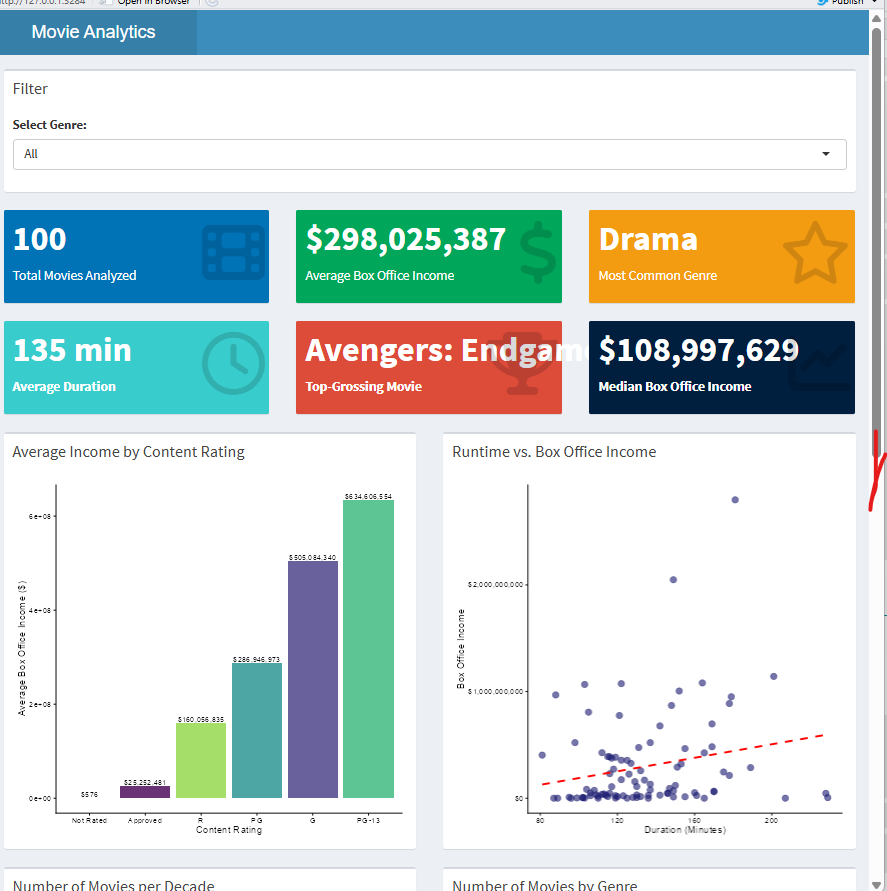
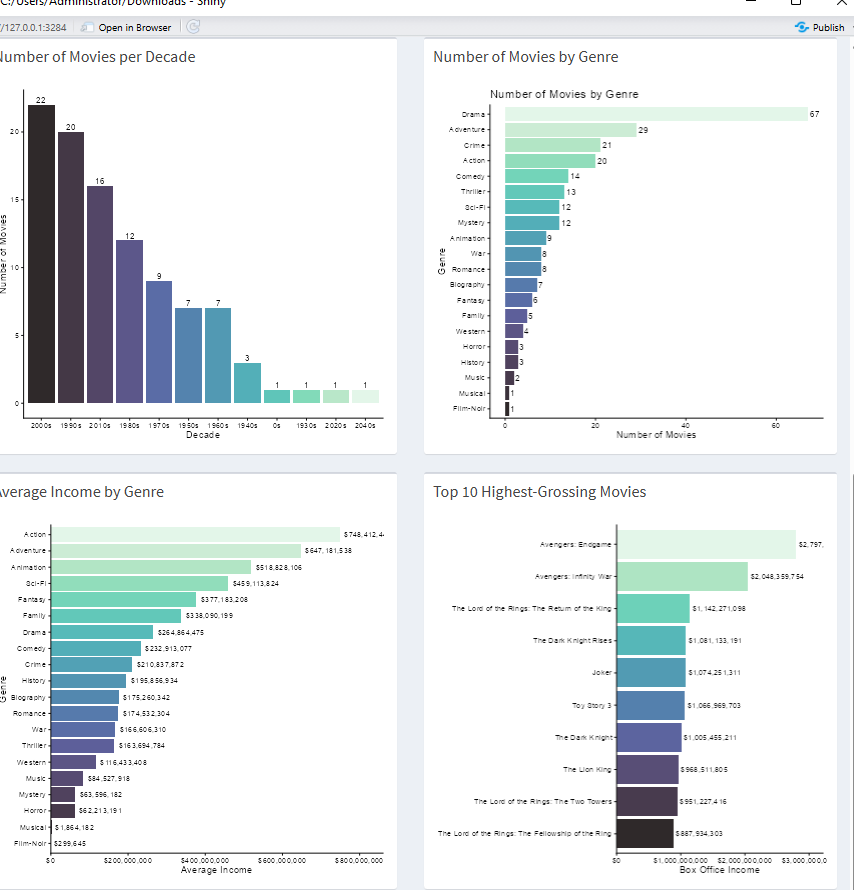

#  R Programming & Statistical Analysis Portfolio

**Analyst:** Olawoyin Olufunmilayo Esther

## Overview
This repository contains advanced statistical data analyses and exploratory programming projects built using **R** (`tidyverse`, `ggplot2`), focusing on public health epidemiology and educational data mining.

---

### 🏥 IDSS2 Disease Outbreak & Health Analytics Dashboard

**Analyst:** Olawoyin Olufunmilayo Esther

## 🎯 Problem Statement
Despite continuous efforts in disease monitoring, there is limited visibility into how different diseases spread across states, affect various age and gender groups, and vary in their recovery and fatality outcomes. Without a clear understanding of these patterns, allocating resources effectively, targeting interventions, or anticipating emerging public health risks remains difficult. 

This project addresses these gaps by exploring trends in reported, confirmed, recovered, and fatal cases across multiple diseases within the IDSS2 dataset.

## 🛠️ Tools & Skills
* **R Programming** (Data Cleaning, Preprocessing, Exploratory Data Analysis, Statistical Summary Metrics).
* **Microsoft Power BI** (Interactive Visualizations, Data Modeling, Dashboard Layouts).
* **Public Health Analytics** (Geospatial Recovery Rates, Disease Prevalence, Temporal Trend Analysis).

## 📊 Dashboard Preview

## 💡 Key Findings & Insights
* **Overall Metrics:** The dashboard tracks an average recovery rate of 62.0%, across 132K confirmed cases, 156.6K reported cases, and 13K total deaths.
* **Disease Prevalence & Breakdown:** Analysis covers five primary diseases (Malaria, COVID-19, Tuberculosis, Typhoid, and Cholera) out of a dataset containing 500 observations and 15 variables. Malaria recorded the highest proportion frequency (0.22), followed by Typhoid (0.206) and COVID-19 (0.20).
* **Demographic Breakdown:** Patients show an average age range between 36.8 and 40.4 years across diseases, with a nearly even gender vulnerability distribution of 50.42% male (67K) and 49.58% female (66K).
* **Geographic Disparities:** Recovery performance varies across states, with Plateau and Kano leading recovery sums while Lagos records lower throughput figures.
* **Temporal Trends (2018–2022):** Multi-year quarterly tracking of recovery rates reveals cyclical fluctuations, providing a historical baseline for outbreak preparedness.

## 🚀 Strategic Recommendations
* **Targeted Resource Allocation:** Direct healthcare resources and intervention programs to states with lower recovery rates.
* **Age & Gender Specific Programs:** Implement tailored public health outreach addressing the specific age demographics most affected by conditions like malaria and typhoid.
---
## project 2: Problem Statement
There is a common assumption that a student's academic performance is heavily dictated by lifestyle habits, study hours, and external resources like internet access. Educational institutions and students often pour energy into optimizing these environmental factors, assuming they are the primary levers for better grades. 

This project tests that assumption by analyzing a dataset of 5,000 students to uncover what truly drives academic success—distinguishing between actual core subject mastery and external behavioral metrics.

## Tools & Skills
* **R Programming** (Tidyverse, Statistical Modeling)
* **Data Visualization** (ggplot2 for Distribution Analysis and Correlation Plots)
* **Statistical Analysis** (Multiple Linear Regression, Correlation Metrics, Data Leakage Diagnostics)

## Key Findings & Insights
* **Disproving External Assumptions:** Statistical testing revealed that internet access (94.6% vs 94.8% pass rate), student age, and study hours have virtually zero correlation with final grades ($r = -0.013$ for study hours). 
* **Data Leakage Resolution:** Initial multiple linear regression models produced a suspicious $R^2 = 1.0$ score. Investigating this uncovered a data leakage issue, proving that final percentages were mathematically calculated directly from individual subject scores rather than external student behavior.
* **Core Drivers of Success:** True academic performance is strictly governed by core subject mastery (Math, English, and Science). The data shows it is not simply how many hours a student spends reading that secures a good grade, but rather strategic, intentional focus on core subjects.

## Strategic Recommendations
* **Shift Institutional Focus:** Redirect academic support programs away from generalized lifestyle counseling and toward targeted core subject tutoring.
* **Optimize Study Quality over Quantity:** Advise students to move away from passive, time-heavy study routines and instead focus on mastery-based preparation for Math, English, and Science.

## Repository Files
* `analysis.R`: The underlying R script used for statistical testing, regression modeling, and data cleaning.
* `student_dataset.csv`: The cleaned 5,000-student dataset used for the analysis.
  * 
###  Project 3: Movie Data Analytics & Shiny Dashboard

##  Problem Station
Navigating large movie datasets to extract meaningful trends regarding ratings, genres, release years, and audience reception can be overwhelming without interactive tools. Stakeholders often struggle to filter massive collections of film data dynamically to see what truly drives high ratings and box office success. 

This project addresses this gap by building an interactive R Shiny web application that allows users to explore movie metrics dynamically, visualize distribution patterns, and uncover key drivers behind film performance.

## 🛠️ Tools & Skills
* **R Programming** (Data Manipulation, Reactive Programming, Shiny Framework)
* **Interactive Web Development** (UI/Server Architecture, Dynamic Input Filters, Render Functions)
* **Data Visualization** (ggplot2 integration within Shiny for real-time charting)

## 📊 Shiny App Preview

### 1. Movie Analytics Dashboard - Overview

*Displays the main interactive interface, tracking key metrics, filters, and overall dataset distribution.*

### 2. Movie Analytics Dashboard - Detailed Breakdown

*Highlights advanced filtering options, deep-dive visualizations, and comparative metrics across categories.*

## 💡 Key Findings & Insights
* **Dynamic Filtering:** The application successfully isolates specific subsets of movies based on user-defined parameters such as release windows, genre selections, and rating thresholds.
* **Rating Distributions:** Visualizations reveal distinct clusters in user ratings, highlighting how certain genres consistently command higher average scores compared to others.
* **User Engagement:** Interactive exploration shows clear trends in how volume and popularity metrics scale alongside critical acclaim.

## 🚀 Strategic Recommendations
* **Content Strategy:** Utilize genre specific performance filters to guide content acquisition or production focus toward high rating categories.
* **User Experience Optimization:** Further expand input parameters in future app iterations to include director and cast performance drill-downs.

## 📁 Repository Files
* `movie_dataset.R`: The core R script containing the Shiny application user interface (UI) and server logic.
* `movie_1.png` & `movie_2.png`: Visual captures of the application dashboard interfaces.
